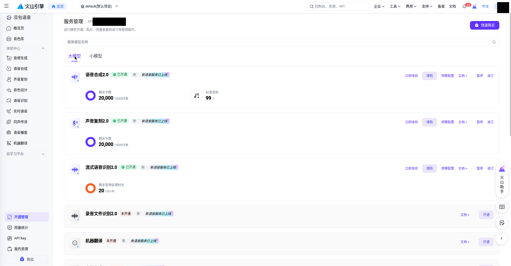
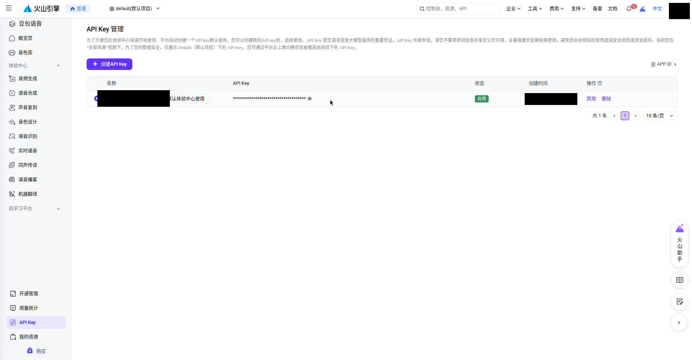
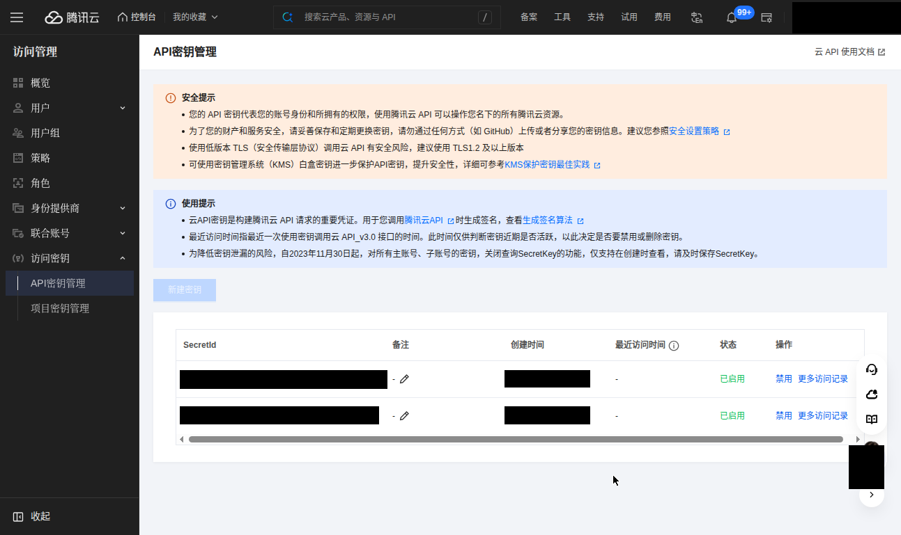
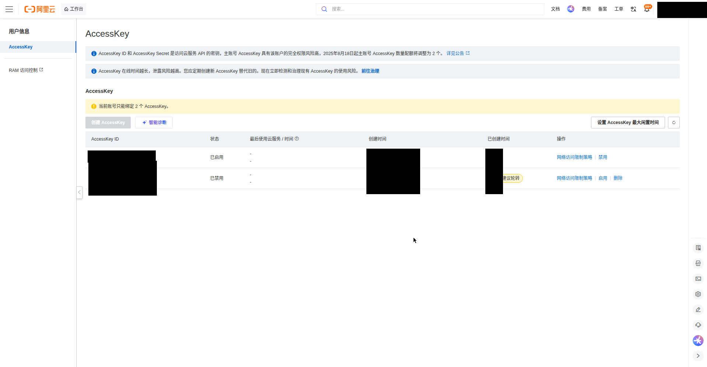

This guide is for **speech-to-text (ASR)**. For screenshots and images, use the separate [cloud OCR setup guide](../ocr-cloud-credentials/). Service activation, permissions and upload consent are separate.

## Account and region guide

**Start with Deepgram if you want an English-language cloud setup.** Local recognition needs no cloud account. Cadenza currently supports Deepgram plus five China-based speech integrations; OpenAI and ElevenLabs are not yet available in the app.

| Provider | Registration or sign-in | Integration scope |
| --- | --- | --- |
| Deepgram | [International signup](https://console.deepgram.com/signup) | English console; follow the steps below |
| Tencent Cloud | [International site](https://www.tencentcloud.com/) · [China site](https://cloud.tencent.com/) | Walkthrough uses the China console; international accounts have not been validated in Cadenza |
| Alibaba Cloud | [International site](https://www.alibabacloud.com/) · [China site](https://www.aliyun.com/) | Walkthrough uses mainland NLS; international account and region compatibility require validation |
| Volcengine | [China console](https://console.volcengine.com/) | Doubao Speech; BytePlus credentials are not interchangeable |
| Baidu | [Account portal](https://login.bce.baidu.com/) | China speech service; console may be Chinese |
| iFLYTEK | [Open platform](https://www.xfyun.cn/) | China speech dictation service; console may be Chinese |

Changing the UI language does not change your primary engine, account region or upload destination. International and China accounts must not be assumed to share credentials or service activation. The translated screenshots below are references for the China consoles, not international-console walkthroughs.

Open **Settings → Speech → Cloud services → Configure**. Local models do not require a cloud account or API key.

The screenshots were provided by Lulu on **7 October 2026**, with account details and credentials obscured. They show Chinese consoles; labels may change. Check the provider's pricing before activating a service.

## Deepgram setup

1. [Create a Deepgram account](https://console.deepgram.com/signup), then open the [console](https://console.deepgram.com/).
2. Select your project, open **Settings → API Keys → Create a New API Key**, and grant permission to call speech recognition.
3. Copy the secret when it is displayed and paste it into Cadenza’s **API Key** field. Keep it private; the console does not show the secret again.
4. Choose the recognition language in Cadenza, review upload consent, then test the connection. These steps have no account screenshots yet.

[Official Deepgram key creation guide](https://developers.deepgram.com/docs/create-additional-api-keys)

## Volcengine setup

1. Open the [Doubao Speech console](https://console.volcengine.com/speech/new/setting/apikeys). Select **开通管理** (service activation), find **流式语音识别 2.0** (streaming speech recognition 2.0), and activate it if necessary. The screenshot shows an already activated service.

2. Select **API Key**, then **创建 API Key** (create API key). To copy an existing key, use the eye icon to reveal its full value.

3. Paste it into Cadenza's **API Key** field. This integration uses a Doubao Speech API key, not a general IAM AccessKey. No App ID is needed.

[Official API key documentation](https://docs.volcengine.com/docs/DoubaoVoice/APIKeyUsage?lang=zh)

## Tencent Cloud

1. Search for **访问管理** (access management) in the console. Open **访问密钥 → API 密钥管理** (access keys → API key management), create a key and retain its **SecretId** and **SecretKey**. The secret is shown only at creation. The screenshot shows the list, not the dialog revealing a new secret.

2. Fill **SecretId → Secret ID** and **SecretKey → Secret Key** in Cadenza.
3. Open the account menu at the top right, select account information and copy **APP ID** into Cadenza's **Account AppID** field.
4. Ensure [speech recognition](https://console.cloud.tencent.com/asr) is activated and your credentials have permission to call it.

[API key management](https://console.cloud.tencent.com/cam/capi)

## Alibaba Cloud

1. Open the [RAM console](https://ram.console.aliyun.com/) and create an **AccessKey** pair for an authorized RAM user. Copy **AccessKey ID** and **AccessKey Secret** into Cadenza's matching fields. Prefer a RAM user with speech service permissions. The screenshot shows the entry point; the create button may be unavailable for your identity or key limit.

2. Activate Intelligent Speech Interaction in the [speech console](https://nls-portal.console.aliyun.com/), open **全部项目／项目管理** (all projects / project management), and create a project.
3. Copy that project's **Appkey** into Cadenza's **NLS AppKey** field.

**The project Appkey is different from AccessKey ID and AccessKey Secret. All three fields are required.**

[Official project guide](https://www.alibabacloud.com/help/en/isi/user-guide/manage-projects) · [Official quick start](https://www.alibabacloud.com/help/en/isi/getting-started/start-here)

## Baidu AI Cloud

Text reference only: the supplied tutorial has no Baidu screenshots or live-account validation.

Open [Baidu AI Cloud](https://cloud.baidu.com/), [sign in](https://login.bce.baidu.com/) and enter the [speech console](https://console.bce.baidu.com/ai-engine/speech/overview/index). Complete the account requirements, activate speech recognition and create a speech application. Fill its **API Key** and **Secret Key** into Cadenza's corresponding fields.

## iFLYTEK setup

Field reference, without step-by-step screenshots: open the [iFLYTEK console](https://console.xfyun.cn/), select an application with speech dictation enabled, and find its service credentials. Fill **App ID**, **API Key** and **API Secret** into the three matching fields. API Secret and API Key are different values.

[Official iFLYTEK authentication guide](https://www.xfyun.cn/doc/asr/voicedictation/API.html)

## After filling in the fields

1. Read the audio-upload explanation and decide whether to allow this provider. Without consent, the app does not connect to it.
2. Click **Test connection** and read the feedback beside it. The check tests connection and authentication, sends no recording, and does not replace a recognition test.
3. Click **Save**, select the provider as your primary model, and try a sentence on the input page.

Cancelling stops subsequent uploads but cannot recall audio already sent during streaming. Do not put keys in feedback, screenshots or public documentation.

*Original tutorial: Lulu, 2026-10-07. Adapted with field references for this app.*
